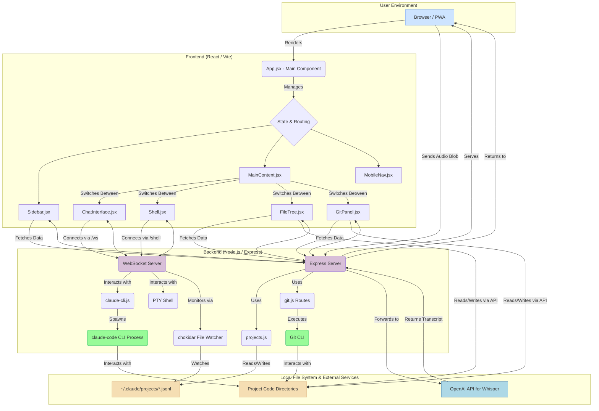

### Codebase Review and Validation

You shall perform a line-by-line review of the entire codebase provided in `project_codebase_files_set.md`. Then prove a summary of your validation:

*   **Consistency and Cohesion:** The project demonstrates a high degree of consistency. The frontend and backend are well-aligned, with the Vite proxy configuration correctly routing API and WebSocket traffic. The component structure is logical, and the use of a shared `utils.js` for `cn` (classnames) function ensures consistent styling application.
*   **Functionality:** The application's features, as described in the `README.md`, are fully implemented in the codebase. The core loop of sending commands to a `claude-cli` process via a WebSocket and streaming the results back to the UI is robustly handled in `server/index.js`, `server/claude-cli.js`, and `src/components/ChatInterface.jsx`.
*   **State Management:** The application employs a combination of local component state (`useState`), React Context (`ThemeContext`), and prop drilling. For its current size, this approach is effective. The "Session Protection System" in `App.jsx` is a clever and necessary piece of state management to prevent UX issues during active chat sessions.
*   **Backend Logic:** The server-side logic is well-organized. `server/projects.js` correctly encapsulates all interactions with the `~/.claude/` directory, including parsing `.jsonl` files, which is a key data source. The `server/claude-cli.js` module provides a clean abstraction for spawning and managing the external `claude` process. The `routes/git.js` module cleanly separates Git-related functionality.
*   **Frontend Components:** The React components are well-defined and modular. `ChatInterface.jsx` is the most complex component, but its logic for handling messages, tool usage, and user input is sound. The use of `xterm.js` in `Shell.jsx` and `CodeMirror` in `CodeEditor.jsx` are standard and correct implementations for their respective features. The UI primitive components in `src/components/ui/` follow best practices, similar to the popular `shadcn/ui` library.
*   **Error Handling and Edge Cases:** The code includes considerations for various states like loading, errors, and empty states. The WebSocket utility (`src/utils/websocket.js`) includes a reconnection mechanism. The session duplication bug in the Claude CLI is also handled with a workaround in `ChatInterface.jsx`, demonstrating attention to real-world issues.
*   **Security:** The backend correctly uses `node-pty` to contain shell sessions and sets the `cwd` (current working directory) for spawned processes, which is a good security practice. File system access APIs perform basic path validation, although this could be hardened further. The `--dangerously-skip-permissions` flag is exposed in the UI, but it's appropriately labeled with a warning, giving control to the user.

The codebase is valid, functional, and well-structured for its intended purpose.

---
# Project Architecture Overview: Claude Code UI

## 1. Executive Summary

Claude Code UI is a sophisticated, full-stack web application designed to provide a rich, responsive, and user-friendly graphical interface for Anthropic's `claude-code` command-line interface (CLI). The application elevates the developer experience from a pure terminal-based interaction to a modern, integrated development environment (IDE)-like web interface that works seamlessly across desktop and mobile devices.

At its core, the system is architected around a **real-time, event-driven model**. It comprises a reactive frontend built with **React and Vite** and a robust backend powered by **Node.js and Express**. The two layers communicate primarily through **WebSockets**, enabling instantaneous, bidirectional data flow for chat messages, shell interactions, and live project updates.

The application's primary function is to discover existing `claude-code` projects on the user's local file system, manage chat sessions within those projects, and provide a suite of powerful tools to interact with the code and the AI. Key features include:

*   **Interactive Chat Interface:** A real-time chat for communicating with the Claude AI, complete with markdown rendering, code block highlighting, and visualization of AI tool usage.
*   **Integrated Shell:** A fully functional terminal emulator powered by `xterm.js` and `node-pty`, providing direct, interactive access to the `claude-code` CLI within the project's context.
*   **Comprehensive File Management:** An interactive file explorer for browsing the project structure, coupled with a powerful in-browser code editor (`CodeMirror`) for viewing and modifying files.
*   **Source Control Integration:** A dedicated Git panel that allows developers to view changes, inspect diffs, and commit their work directly from the UI.
*   **Robust Session Management:** The application automatically discovers and parses session history from `.jsonl` log files, allowing users to seamlessly resume past conversations. A unique "Session Protection System" prevents UI disruptions during active chat sessions.
*   **Responsive and Mobile-First Design:** The entire interface is built with Tailwind CSS and is optimized for a fluid experience on any screen size, featuring adaptive layouts and touch-friendly navigation.
*   **Configurable and Secure:** Users have granular control over AI tool permissions through a dedicated settings panel, with all potentially dangerous operations disabled by default to ensure a secure-by-default posture.

This document provides a deep dive into the technical architecture, data flow, and implementation details of the Claude Code UI, serving as a comprehensive guide for developers looking to understand, maintain, or extend the platform.

## 2. System Architecture Diagram

The application follows a classic client-server model, with clear separation of concerns between the frontend presentation layer and the backend service layer. The diagram below illustrates the high-level components and their primary interactions.



## 3. Technology Stack

The project leverages a modern and robust set of technologies chosen for their performance, developer experience, and suitability for building real-time, interactive applications.

### 3.1. Backend

*   **Runtime:** Node.js
*   **Framework:** Express.js for handling REST API endpoints and serving static files.
*   **Real-time Communication:** `ws` library for the WebSocket server, providing low-latency, bidirectional communication channels for chat and shell interactions.
*   **Process Management:** `node-pty` is used to spawn the `claude-code` CLI within a pseudo-terminal (PTY). This is a critical choice, as it provides a much more authentic and robust terminal experience than `child_process.spawn`, correctly handling terminal colors, sizing, and interactive prompts.
*   **File System Watching:** `chokidar` provides a cross-platform, efficient file system watcher. It monitors the `~/.claude/projects/` directory for changes (new sessions, etc.) and triggers real-time updates to the frontend.
*   **Dependencies:** `cors` for handling cross-origin requests, `mime-types` for serving files with the correct headers.

### 3.2. Frontend

*   **Framework/Library:** React 18, utilizing modern features like hooks for state and lifecycle management.
*   **Build Tool/Dev Server:** Vite provides an extremely fast development server with Hot Module Replacement (HMR) and an optimized build process for production.
*   **Styling:** Tailwind CSS, a utility-first CSS framework, is used for all styling. It's configured with `postcss` and `autoprefixer` for broad browser compatibility. The project also uses `@tailwindcss/typography` for rendering markdown content.
*   **UI Components:**
    *   **Code Editor:** `CodeMirror` (via `@uiw/react-codemirror`) is used for the in-browser file editor, offering syntax highlighting, diffing capabilities, and a rich set of editor features.
    *   **Terminal Emulator:** `xterm.js` is used to render the interactive shell, providing a high-performance, canvas-based terminal experience.
    *   **Icons:** `lucide-react` provides a clean and modern set of SVG icons.
    *   **UI Primitives:** The project uses a pattern similar to `shadcn/ui`, leveraging `class-variance-authority` and `tailwind-merge` to create type-safe, composable, and consistently styled UI components (e.g., `Button`, `Input`, `Badge`).
*   **Routing:** `react-router-dom` is used for client-side routing, enabling direct navigation to specific chat sessions via URLs (`/session/:sessionId`).
*   **State Management:** The application primarily relies on React's built-in state management (`useState`, `useEffect`, `useReducer` implicitly through `useState`'s setter). `useContext` is used for the application-wide theme state. `localStorage` is used for persisting user settings and draft messages.
*   **Audio Transcription:** The `MediaRecorder` Web API is used to capture audio, which is then sent to a backend endpoint that uses the OpenAI Whisper API for transcription.

### 3.3. Development & Tooling

*   **Package Manager:** `npm` is used for managing project dependencies.
*   **Concurrent Operations:** `concurrently` is used in the `dev` script to run the frontend Vite server and the backend Node.js server simultaneously.
*   **Environment Variables:** The project uses `.env` files to manage environment-specific configurations like ports, with `.env.example` serving as a template. Vite's `loadEnv` function is used to correctly load these variables.

## 4. File and Folder Structure

The project's structure is logically organized, with a clear separation between the server-side and client-side code. This promotes maintainability and scalability.

```
claude-code-ui/
├── .env.example            # Example environment variables for configuration
├── .gitignore              # Specifies files and directories to be ignored by Git
├── package.json            # Project metadata, dependencies, and scripts
├── postcss.config.js       # Configuration for PostCSS (used by Tailwind)
├── tailwind.config.js      # Configuration for Tailwind CSS framework
├── vite.config.js          # Configuration for the Vite build tool and dev server
├── README.md               # Project documentation
├── public/                 # Static assets served directly
│   ├── index.html          # Main HTML entry point for the application
│   ├── sw.js               # Service Worker for PWA functionality
│   ├── manifest.json       # PWA manifest file
│   ├── icons/              # Application icons for PWA and favicon
│   └── *.svg, *.png        # Other static assets like logos
├── server/                 # Backend Node.js/Express application
│   ├── index.js            # Main server entry point: sets up Express, WebSockets, and routes
│   ├── projects.js         # Logic for discovering and managing Claude projects and sessions
│   ├── claude-cli.js       # Wrapper for spawning and interacting with the `claude-code` CLI
│   └── routes/             # Express routes
│       └── git.js          # API endpoints for all Git-related operations
└── src/                    # Frontend React application source code
    ├── App.jsx             # Root React component, handles layout, routing, and top-level state
    ├── main.jsx            # React application entry point (renders App.jsx)
    ├── index.css           # Global CSS and Tailwind CSS directives
    ├── components/         # Reusable React components
    │   ├── ui/             # Generic, reusable UI primitive components (Button, Input, etc.)
    │   ├── ChatInterface.jsx # The core chat UI and logic
    │   ├── Shell.jsx       # The integrated terminal component
    │   ├── FileTree.jsx    # The project file explorer component
    │   ├── CodeEditor.jsx  # The modal code editor component
    │   ├── Sidebar.jsx     # The main sidebar for project and session navigation
    │   └── ... (other components)
    ├── contexts/           # React Context providers
    │   └── ThemeContext.jsx  # Manages the application's light/dark theme
    ├── hooks/              # Custom React hooks
    │   └── useAudioRecorder.js # Hook for managing audio recording state and logic
    └── utils/              # Utility functions and modules
        ├── websocket.js    # Custom hook for managing the WebSocket connection
        ├── whisper.js      # Utility for interacting with the transcription API
        └── utils.js        # General utility functions (e.g., `cn` for classnames)
```

### Folder and Key File Purposes

*   **`public/`**: This directory contains static assets that are served as-is by the web server. `index.html` is the single-page application's shell. `sw.js` and `manifest.json` are crucial for the Progressive Web App (PWA) functionality, enabling offline capabilities and the "Add to Home Screen" feature.
*   **`server/`**: This is the heart of the backend.
    *   `index.js`: Orchestrates the entire backend. It initializes the Express server, sets up the WebSocket server, defines all API routes, and integrates the other backend modules. It's also responsible for setting up the `chokidar` file watcher.
    *   `projects.js`: A critical data-access module that abstracts all file system interactions related to `claude-code` projects. It knows how to find projects, parse the `.jsonl` session logs, and manage project metadata. This decouples the main server logic from the specifics of Claude's storage format.
    *   `claude-cli.js`: This module is the direct bridge to the `claude-code` tool. It encapsulates the logic for constructing the correct command-line arguments and spawning the process, handling its stdout, stderr, and exit events.
    *   `routes/git.js`: Defines all endpoints under `/api/git`. It works by executing standard `git` commands on the command line and parsing their output, providing a secure API for the frontend to interact with the project's repository.
*   **`src/`**: Contains all the frontend React code.
    *   `App.jsx`: The top-level component that acts as the application's orchestrator. It manages the highest-level state (like the list of projects and the currently selected session), handles routing, and lays out the main UI structure (Sidebar and MainContent). Its most important custom feature is the **Session Protection System**.
    *   `components/`: This directory is well-organized into feature components (like `ChatInterface`, `Shell`) and UI primitives (`ui/`). This separation is a best practice that makes the codebase easier to navigate and maintain.
    *   `contexts/` and `hooks/`: These directories follow standard React patterns for sharing cross-cutting concerns (like theme) and encapsulating reusable logic (like audio recording and WebSocket connections).
    *   `utils/`: A standard location for helper functions that don't fit into the other categories. `websocket.js` is particularly important as it manages the entire lifecycle of the main WebSocket connection.
*   **Root Files**: The configuration files at the root (`vite.config.js`, `tailwind.config.js`, etc.) define how the project is built, developed, and styled, providing a single source of truth for the project's tooling.

## 5. Key Features and Implementation Details

This section explores the technical implementation of the application's core features, tracing the flow of data from the user interface to the backend and external services.

### 5.1. Project and Session Management

This is a foundational feature of the application, allowing it to serve as a dashboard for all of a user's `claude-code` activities.

**Discovery and Data Fetching:**
1.  **Backend (`server/projects.js`):** The `getProjects` function is the authoritative source for project data. It scans the `~/.claude/projects/` directory. Each subdirectory is treated as a project. The project name is derived from the directory name (e.g., `-home-user-project-my-app`). It also consults `~/.claude/project-config.json` to allow users to set custom, more readable display names.
2.  **Session Parsing:** For each project, the `getSessions` function reads all `.jsonl` files. It cleverly parses these log files, which are append-only streams of JSON objects, to reconstruct session metadata. It builds a map of sessions to avoid duplicates and extracts the summary and last activity timestamp for each one. To optimize performance, it only fetches a paginated list of the most recent sessions initially.
3.  **Frontend (`src/App.jsx`):** On initial load, the `App` component's `useEffect` hook calls `fetchProjects`, which makes a GET request to the `/api/projects` endpoint. The fetched data is stored in the `projects` state variable and passed down to the `Sidebar` component.

**Real-time Updates and Session Protection:**
This is one of the most sophisticated features of the application, ensuring a smooth user experience.
1.  **File Watching (`server/index.js`):** The backend uses `chokidar` to monitor the `~/.claude/projects/` directory for any changes (e.g., a new line being added to a `.jsonl` file as a chat progresses).
2.  **WebSocket Broadcast:** When a change is detected, a debounced handler sends a `projects_updated` message via WebSocket to all connected clients. This message contains the complete, refreshed list of projects and sessions.
3.  **Frontend Reception (`src/App.jsx`):** The `App` component listens for `projects_updated` messages. Here, the **Session Protection System** comes into play. If the user is in an active conversation (tracked by the `activeSessions` set), the component will not naively replace the `projects` state. It performs a check (`isUpdateAdditive`) to see if the update would disrupt the current view. If the update only adds new projects or sessions without modifying the currently selected one, it is allowed to proceed. This prevents the chat history from being cleared or re-rendered while the user is actively interacting with it.
4.  **Session Lifecycle Tracking:**
    *   When the user sends a message (`ChatInterface.jsx`), `onSessionActive` is called, adding the current session ID (or a temporary one for a new chat) to the `activeSessions` set in `App.jsx`, thus "protecting" it.
    *   When the `claude-complete` or `session-aborted` WebSocket message is received, `onSessionInactive` is called, removing the session ID from the set and allowing normal updates to resume.
    *   For new sessions, a temporary ID like `new-session-167...` is used for protection. When the `session-created` message arrives with the real ID, `onReplaceTemporarySession` is called to swap the temporary ID with the real one, ensuring continuous protection.

### 5.2. Interactive Chat and AI Interaction

This is the application's main purpose. The data flow is entirely event-driven and flows through WebSockets.

1.  **User Input (`src/components/ChatInterface.jsx`):**
    *   The user types a message in the `textarea`. The component handles features like `@` for file mentions.
    *   On `handleSubmit`, a user message object is created and added to the local `chatMessages` state for immediate UI feedback.
    *   A `claude-command` message is constructed, including the user's text, the project path, the current session ID (if any), and the tool settings from `localStorage`. This message is sent to the backend via the `/ws` WebSocket.
2.  **Backend Processing (`server/index.js` and `server/claude-cli.js`):**
    *   The WebSocket server receives the `claude-command`.
    *   It calls `spawnClaude` from `claude-cli.js`. This function dynamically builds the arguments for the `claude` CLI process (e.g., `--print`, `--resume`, `--allowedTools`).
    *   `spawnClaude` spawns the `claude` process using `child_process.spawn`.
3.  **Streaming Response:**
    *   The `claude` process outputs a stream of JSON objects to its `stdout`.
    *   The `data` event handler in `spawnClaude` captures this output. Each line is parsed as JSON.
    *   These parsed JSON objects are then sent back to the frontend over the WebSocket as `claude-response` messages. Types of responses include text content, tool usage requests (`tool_use`), and status updates.
4.  **Frontend Rendering (`src/components/ChatInterface.jsx`):**
    *   The `useWebSocket` hook receives the messages and adds them to the `messages` array in `App.jsx`.
    *   `ChatInterface.jsx` reacts to changes in the `messages` prop. It processes the incoming `claude-response` messages and updates its own `chatMessages` state.
    *   The `MessageComponent` is responsible for rendering. It uses `ReactMarkdown` for text content and has special rendering logic for `isToolUse` messages. For example, if the tool is `Edit`, it calculates and displays a color-coded diff. If it's `Bash`, it shows the command in a terminal-like block.

### 5.3. Integrated Shell

The shell provides a raw, unfiltered interface to the `claude-code` CLI, for users who prefer the terminal experience.

1.  **Frontend (`src/components/Shell.jsx`):**
    *   The component uses `xterm.js` to create a terminal UI.
    *   When the user activates the shell tab and clicks "Connect", it establishes a **separate WebSocket connection** to the `/shell` endpoint on the backend.
    *   An `init` message is sent, containing the project's path and current session ID.
    *   User keystrokes in the `xterm` instance are captured by the `onData` event and sent to the backend as `input` messages.
2.  **Backend (`server/index.js` - `handleShellConnection`):**
    *   On receiving the `init` message, the backend uses `node-pty` to spawn a shell process (e.g., `bash`).
    *   It constructs a command to first `cd` into the project directory and then execute `claude` (with `--resume` if a session ID was provided). `node-pty` is essential here as it emulates a real terminal, allowing `claude-cli`'s interactive features (like arrow keys and prompts) to work correctly.
    *   Data from the `pty` process's `stdout` is captured by the `onData` handler and streamed back to the frontend as `output` messages.
    *   `input` messages received from the frontend are written directly to the `pty` process's `stdin`.
    *   This creates a seamless, low-latency bridge between the frontend `xterm.js` instance and the backend shell process.

### 5.4. Source Control (Git)

This feature integrates version control directly into the UI, making the application feel more like a lightweight IDE.

1.  **Frontend (`src/components/GitPanel.jsx`):**
    *   When the "Source Control" tab is active, the component makes API calls to the backend to fetch Git information.
    *   It calls `/api/git/status` to get the list of modified, added, and deleted files.
    *   For each modified file, it can call `/api/git/diff?file=...` to get the specific changes.
    *   It calls `/api/git/branches` to populate the branch selection dropdown.
2.  **Backend (`server/routes/git.js`):**
    *   This Express router defines endpoints that correspond to Git operations.
    *   Each endpoint handler uses `child_process.exec` to run the equivalent `git` command-line tool (e.g., `git status --porcelain`, `git diff HEAD -- "..."`, `git commit -m "..."`).
    *   The `stdout` of the Git command is captured, parsed into a structured JSON format, and sent back to the frontend.
    *   This approach is effective because it leverages the existing, powerful Git CLI without needing to reimplement Git logic in Node.js. The `cwd` option is used to ensure commands are run in the correct project directory.

## 6. Data Flow Analysis

Understanding the flow of data is key to understanding the application. There are three primary data flow patterns.

### Flow 1: Initial Application Load

*   **User** -> **Browser**: Navigates to the application URL.
*   **Browser** -> **Server**: GET request for `/index.html` and other static assets (JS, CSS).
*   **Server** -> **Browser**: Serves the static files for the React application.
*   **React App (`App.jsx`)** -> **Server**: `fetchProjects()` triggers a GET request to `/api/projects`.
*   **Server (`projects.js`)** -> **File System**: `getProjects()` reads `~/.claude/projects/` and associated `.jsonl` files.
*   **File System** -> **Server**: Returns directory and file contents.
*   **Server** -> **React App**: Responds with a JSON array of project and session data.
*   **React App**: Renders the `Sidebar` with the fetched data.
*   **React App (`websocket.js`)** -> **Server**: Establishes a WebSocket connection to `/ws`.

### Flow 2: User Sends a Chat Message

*   **User** -> **Chat UI (`ChatInterface.jsx`):** Types a message and hits send.
*   **Chat UI**:
    1.  Updates its local state to immediately display the user's message.
    2.  Calls `onSessionActive` to protect the session from UI refreshes.
    3.  Sends a `claude-command` object over the `/ws` WebSocket.
*   **WebSocket Server (`server/index.js`):** Receives the message.
*   **Server (`claude-cli.js`)** -> **OS**: Spawns a new `claude` CLI process with the appropriate arguments.
*   **`claude` Process** -> **Server**: Streams JSON output to `stdout`.
*   **Server (`claude-cli.js`)**: Captures `stdout`, parses it, and sends `claude-response` messages over the WebSocket.
*   **React App (`websocket.js`)**: Receives the streaming messages.
*   **Chat UI (`ChatInterface.jsx`)**: Renders the incoming assistant messages and tool usage information.
*   **`claude` Process** -> **Server**: Exits when done.
*   **Server**: Sends a `claude-complete` message over the WebSocket.
*   **Chat UI**: Hides the loading indicator and calls `onSessionInactive`.

### Flow 3: Live Project Update

*   **External Process (e.g., user runs `claude` in terminal)** -> **File System**: Modifies a file in `~/.claude/projects/`.
*   **File System Watcher (`chokidar` on Server)** -> **Server**: Detects the file change.
*   **Server (`debouncedUpdate`)**:
    1.  Waits for a short debounce period to avoid rapid-fire updates.
    2.  Calls `getProjects()` to get the latest state of all projects and sessions.
    3.  Constructs a `projects_updated` message containing the full, new project list.
*   **WebSocket Server** -> **All Connected Clients**: Broadcasts the `projects_updated` message.
*   **React App (`App.jsx`)**:
    1.  Receives the message.
    2.  Checks if a session is protected via the Session Protection System.
    3.  If safe to do so, updates the `projects` state, which causes the `Sidebar` to re-render with the latest information.

## 7. Potential Improvements and Considerations

While the architecture is robust and well-suited for its purpose, several areas could be enhanced in future iterations.

*   **State Management:** As the application grows, the prop-drilling pattern (e.g., for session protection functions) could become cumbersome. Migrating to a centralized state management library like **Zustand** or **Redux Toolkit** would simplify state logic, improve performance with memoized selectors, and make the codebase easier to debug with dedicated devtools.
*   **Scalability of Session Parsing:** The current implementation in `projects.js` reads and parses `.jsonl` files on-demand. For projects with a very large number of sessions and long histories, this could become a performance bottleneck on the server. A potential optimization would be to introduce a lightweight database like **SQLite**. A background process could watch the `.jsonl` files and populate the SQLite database, making session queries much faster and more scalable.
*   **Security Hardening:**
    *   The execution of shell commands and file system access should be further audited. While `node-pty` and `cwd` provide a good layer of containment, additional validation could be added to ensure that file paths passed from the client are strictly sanitized and validated against the project's root directory to prevent path traversal attacks.
    *   The `--dangerously-skip-permissions` flag is a powerful feature. The application could implement a more sophisticated permissions model, perhaps allowing users to grant permissions on a per-session or per-project basis that are remembered by the server.
*   **Component and Data Caching:** The frontend could benefit from more aggressive caching. For example, the results of `/api/git/status` or file contents could be cached in memory or `sessionStorage` to reduce redundant API calls when switching between tabs. Libraries like **React Query** (TanStack Query) would excel here, providing caching, background refetching, and stale-while-revalidate logic out of the box.
*   **Testing Strategy:** The codebase currently lacks an automated testing suite. Introducing a testing strategy would significantly improve its long-term maintainability.
    *   **Unit Tests:** Use **Vitest** to write unit tests for utility functions (`projects.js`, `claude-cli.js`) and complex React component logic.
    *   **Integration Tests:** Test the interaction between the frontend and the mock backend API.
    *   **End-to-End (E2E) Tests:** Use a framework like **Playwright** or **Cypress** to simulate user workflows, such as starting a chat, using a tool, and committing a file.
*   **Live Preview Feature:** The `MainContent.jsx` component contains commented-out code for a "Preview" tab. Fully implementing this feature, which would likely involve spawning a development server for the user's project and proxying it through an `iframe`, would be a major enhancement, turning the application into an even more capable development tool.

---
https://drive.google.com/file/d/10TzZBanVywsQ4wIRHlVKBEGhnr7J1-48/view?usp=sharing, https://aistudio.google.com/app/prompts?state=%7B%22ids%22:%5B%221V1s5EpCBFT6OmKlYW1Ss3vH_GqC5K39A%22%5D,%22action%22:%22open%22,%22userId%22:%22108686197475781557359%22,%22resourceKeys%22:%7B%7D%7D&usp=sharing, https://drive.google.com/file/d/1X_tGbGaIxCPP900vyC7kz0sNZfgwIRbH/view?usp=sharing

