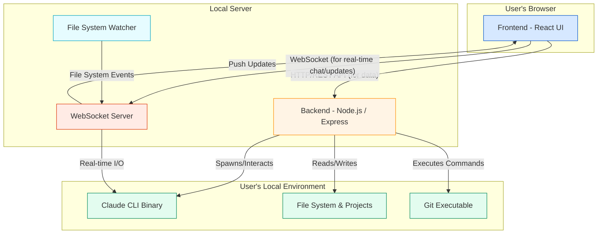

# Project Architecture Overview Document.md

## 1. Introduction & System Vision

The Claude Code Web UI is a sophisticated, full-stack web application designed to serve as a rich, interactive, and cross-device user interface for the `claude-code` Command Line Interface (CLI). Its primary purpose is to elevate the developer experience of interacting with Anthropic's AI coding assistant from a text-only terminal environment to a modern, graphical web interface.

The application is architected to be a robust and secure bridge between the user's browser and their local development environment. It provides a comprehensive suite of tools that mirror and enhance the CLI's capabilities, including project management, real-time chat, an integrated terminal, a file system explorer with editing capabilities, and source control management via Git.

The core architectural vision is built on three pillars:

1.  **Decoupling & Separation of Concerns:** A clear distinction is maintained between the frontend presentation layer and the backend service layer. The backend is the single source of truth for file system operations, CLI interactions, and Git commands, ensuring security and control. The frontend is responsible for rendering the UI and managing user interactions, communicating with the backend via a well-defined API.
2.  **Real-Time Interactivity:** The application heavily leverages WebSockets to provide a seamless, real-time experience. This is fundamental for streaming chat responses from Claude, receiving live updates from the file system watcher, and providing an interactive pseudo-terminal (PTY) experience directly in the browser.
3.  **Security & Stability:** A significant focus of the architecture is on security and stability. Recent improvements have introduced strict path validation to prevent traversal attacks, command execution hardening to eliminate injection vulnerabilities, and memory management improvements (like the LRU cache for shell sessions) to ensure long-term stability.

The technology stack consists of a **React** frontend built with **Vite**, a **Node.js/Express** backend, and extensive integration with the local file system and `claude` binary.

## 2. High-Level Architecture Diagram

The system is composed of three primary layers that interact over defined protocols. The diagram below illustrates the information flow and the separation of responsibilities between these layers.



**Information Flow Breakdown:**

1.  **Initial Load:** The user's browser loads the React frontend from the Express static server.
2.  **Data Fetching:** The frontend makes initial REST API calls to the backend (e.g., `/api/projects`) to populate the UI.
3.  **Real-Time Connection:** The frontend establishes a persistent WebSocket connection to the backend for real-time communication.
4.  **User Actions:**
    *   **Chat:** A user sends a message. The frontend sends a `claude-command` message over the WebSocket. The backend spawns a `claude` CLI process, pipes the input, and streams the output back over the WebSocket.
    *   **File Operation:** A user views the file tree. The frontend calls the `/api/projects/:projectName/files` endpoint. The backend reads the file system and returns the structure.
    *   **Git Operation:** A user checks the Git status. The frontend calls `/api/git/status`. The backend securely executes the `git` command using `spawnAsync` and returns the result.
5.  **Backend Events:** The `chokidar` file system watcher detects a change in a project directory (e.g., a file is added by an external editor). It notifies the WebSocket server, which then broadcasts a `projects_updated` event to all connected clients, causing their sidebars to refresh automatically.

## 3. File Structure & Folder Purpose

The project's file structure is logically organized to separate backend, frontend, and public assets. This clear separation aids in maintainability and independent development of the client and server.

```
claude-code-ui/
├── .env.example        # Example environment variables
├── .gitignore          # Standard git ignore file
├── package.json        # Project dependencies and scripts
├── server/             # Backend Node.js/Express application
│   ├── index.js        # Main server entry point, Express setup, WebSocket hub
│   ├── claude-cli.js   # Logic for spawning and managing the claude CLI process
│   ├── projects.js     # Data access layer for project and session files
│   ├── utils.js        # Security and utility functions (path validation, spawn wrapper)
│   └── routes/
│       └── git.js      # Express router for all /api/git endpoints
├── src/                # Frontend React application source
│   ├── components/     # Reusable React components
│   │   ├── ui/         # Base UI components (Button, Input, etc.)
│   │   ├── ChatInterface.jsx   # Core chat component
│   │   ├── GitPanel.jsx        # Git source control panel
│   │   ├── Shell.jsx           # Integrated xterm.js terminal component
│   │   └── ... (other components)
│   ├── contexts/       # React Context providers for state management
│   │   ├── AppContext.jsx      # Primary application state (projects, sessions, etc.)
│   │   └── ThemeContext.jsx    # Dark/light mode theme management
│   ├── hooks/          # Custom React hooks
│   │   └── useAudioRecorder.js # Hook for microphone access
│   ├── lib/            # General utility libraries
│   │   └── utils.js    # `cn` utility for Tailwind CSS class merging
│   ├── utils/          # Frontend utility functions
│   │   ├── websocket.js  # Custom hook for WebSocket management
│   │   └── whisper.js    # Client-side logic for transcription API
│   ├── App.jsx         # Root React component, manages layout and routing
│   ├── index.css       # Global styles and Tailwind CSS directives
│   └── main.jsx        # Frontend entry point, renders the App
├── public/             # Static assets served directly
│   ├── icons/          # PWA and favicon icons
│   ├── screenshots/    # Images for the README
│   ├── index.html      # Main HTML template
│   ├── manifest.json   # PWA manifest
│   └── sw.js           # Service Worker for PWA functionality
├── tailwind.config.js  # Tailwind CSS configuration
└── vite.config.js      # Vite build and dev server configuration
```

## 4. Detailed Component & Module Breakdown

This section provides a deep dive into the purpose and functionality of each key file and module in the codebase.

### 4.1. Backend (`server/`)

The backend is a Node.js application using the Express framework. It is the trusted core of the system, responsible for all interactions with the user's local environment.

#### **`server/index.js` - The Central Hub**

This file is the main entry point for the backend. Its responsibilities are:
*   **Environment Loading:** Loads environment variables from the `.env` file.
*   **Express Server Setup:** Initializes the Express app, configures CORS for cross-origin requests from the Vite dev server, and sets up middleware for parsing JSON bodies.
*   **Static File Serving:** In a production build, it serves the static assets from the `dist` directory.
*   **API Routing:** It defines all the REST API endpoints that the frontend consumes. These endpoints are the primary mechanism for fetching initial state and performing discrete actions. Key endpoints include:
    *   `/api/config`: Provides the frontend with the correct WebSocket URL, dynamically determined by the server's network address.
    *   `/api/projects`: Fetches the list of all Claude projects.
    *   `/api/projects/:projectName/...`: Endpoints for fetching project-specific data like sessions, files, and messages. These have been hardened with path validation.
    *   `/api/transcribe`: An endpoint that receives audio data, forwards it to the OpenAI Whisper API for transcription, and optionally enhances the result using a GPT model.
*   **Git Route Integration:** It mounts the Git-related routes from `server/routes/git.js` under the `/api/git` prefix.
*   **WebSocket Server:** It creates a single `WebSocketServer` instance attached to the HTTP server. The `on('connection')` handler acts as a multiplexer, routing incoming connections to either the chat handler (`handleChatConnection`) or the shell handler (`handleShellConnection`) based on the request URL (`/ws` or `/shell`).
*   **File System Watcher:** It initializes the `chokidar`-based file system watcher to monitor the `~/.claude/projects` directory for real-time changes, which are then broadcast to clients via WebSockets.

#### **`server/utils.js` - Security & Shared Utilities**

This is a critical new module introduced during the security hardening phase. It centralizes security-critical logic to ensure consistency and prevent vulnerabilities.
*   **`getActualProjectPath(projectName)`:** This function is the single source of truth for resolving a project's encoded name (e.g., `-home-user-project`) into its true, absolute file system path. It uses a robust, multi-step process: first checking the `project-config.json` for manual overrides, then looking for a `metadata.json` file, and finally falling back to the simple path decoding. This makes the system more flexible and reliable.
*   **`isPathSafe(filePath, projectRoot)`:** A crucial security function that prevents path traversal attacks. It resolves both the requested file path and the project's root path to their absolute forms and verifies that the file path is strictly within the root directory. This function is used in all file-accessing API endpoints.
*   **`spawnAsync(command, args, options)`:** A secure wrapper around Node.js's `child_process.spawn`. It was created to replace all instances of `exec`, which is vulnerable to command injection. By enforcing that the command and its arguments are passed as a separate array, it becomes impossible for user-supplied input (like a filename) to be misinterpreted as part of the command itself. It returns a Promise, making it easy to use with `async/await`.

#### **`server/routes/git.js` - Git Operations API**

This Express router handles all Git-related functionality. It has been significantly refactored for security.
*   **Endpoint Structure:** It provides endpoints for common Git operations: `/status`, `/diff`, `/commit`, `/branches`, `/checkout`, `/create-branch`, and commit history/diffs.
*   **Security:** Every Git command is now executed through the `spawnAsync` utility from `server/utils.js`. This is a critical security enhancement that mitigates the risk of command injection. For example, a request for a diff on a file named `"; rm -rf /"` would previously have been a severe vulnerability with `exec`; with `spawnAsync`, it is safely passed as a literal filename argument to `git`.
*   **Path Resolution:** It uses the centralized `getActualProjectPath` utility to find the correct directory for a given project before running any Git commands.
*   **Functionality:** It provides detailed information to the frontend, such as parsing the output of `git status --porcelain` into structured JSON and handling diffs for both staged and unstaged changes. It also includes an endpoint (`/generate-commit-message`) for generating a simple commit message, which could be enhanced with an AI call in the future.

#### **`server/claude-cli.js` - CLI Process Management**

This module is the direct interface to the `claude` binary.
*   **`spawnClaude(command, options, ws)`:** This is the core function. It dynamically constructs the arguments for the `claude` CLI based on the user's request from the frontend. This includes the main command/prompt, session resumption (`--resume`), model selection, and crucially, the user's configured tool permissions (`--allowedTools`, `--disallowedTools`, `--dangerously-skip-permissions`).
*   **Process Spawning:** It uses `child_process.spawn` to run the `claude` command in the correct project directory (`cwd`).
*   **I/O Streaming:** It listens to the `stdout` of the `claude` process. Since Claude streams JSON objects, this function parses each line of output and forwards the structured data to the frontend via the provided WebSocket connection. It also handles `stderr` for error reporting.
*   **Process Management:** It maintains a `Map` of `activeClaudeProcesses` keyed by session ID. This allows it to manage and, if necessary, terminate specific Claude sessions, which is exposed via the `abortClaudeSession` function.

#### **`server/projects.js` - Project Data Layer**

This module encapsulates all logic related to reading and managing project and session data from the file system.
*   **Project Discovery (`getProjects`)**: It scans the `~/.claude/projects` directory to find all projects. It enriches this data with custom display names from `project-config.json` and fetches a summary of recent sessions.
*   **Session Parsing (`getSessions`, `parseJsonlSessions`)**: It reads the `.jsonl` files within a project directory. A key performance optimization is that it first sorts these log files by modification time and processes the newest ones first, allowing it to quickly find the most recent sessions for display in the UI without having to parse every single log file on every request. It parses these line-delimited JSON files to extract session metadata like ID, summary, message count, and last activity time.
*   **Message Retrieval (`getSessionMessages`)**: For a specific session, this function reads through all relevant `.jsonl` files to find and return the complete message history, sorted by timestamp.
*   **Configuration Management:** It includes functions to load and save `project-config.json`, which stores user-defined project display names and other metadata.
*   **CRUD Operations:** It provides functions for `renameProject`, `deleteSession`, and `deleteProject`, which manipulate the file system and configuration files accordingly.

### 4.2. Frontend (`src/`)

The frontend is a modern React single-page application (SPA) built with Vite. Its architecture centers around a component-based structure with a centralized state management system using React Context.

#### **`src/main.jsx` & `src/index.css`**
*   `main.jsx`: The application entry point. Its key responsibility is to set up the context providers. It wraps the entire `App` component in `<ThemeProvider>` (for dark/light mode) and `<AppProvider>` (for all application state), ensuring that every component in the tree can access this shared context.
*   `index.css`: Defines global styles, sets up Tailwind CSS directives (`@tailwind base`, `@tailwind components`, `@tailwind utilities`), and contains CSS variables for theming. A crucial part of this file is the set of fixes for dark mode form elements (textareas, checkboxes) and mobile-specific styles, including touch optimizations and safe area handling for iOS.

#### **`src/contexts/` - The Application's "Brain"**

*   **`AppContext.jsx`:** This is the most important file in the frontend architecture. It eliminates the need for "prop drilling" by providing a single, centralized store for global application state.
    *   **State Management:** It uses `useState` and `useEffect` to manage all critical shared state: `projects`, `selectedProject`, `selectedSession`, `activeTab`, `isMobile`, `sidebarOpen`, and all user-configurable settings (`autoExpandTools`, etc.).
    *   **WebSocket Integration:** It initializes the `useWebSocket` hook, making the `sendMessage` function and incoming `messages` available to the entire application.
    *   **Session Protection System:** This context is home to the critical session protection logic. It maintains the `activeSessions` set. It exposes functions (`markSessionAsActive`, `markSessionAsInactive`, `replaceTemporarySession`) that `ChatInterface` can call to notify the context when a conversation starts and ends. The context then uses this information to decide whether to apply real-time `projects_updated` events from the WebSocket, preventing a chat from being cleared by a sidebar refresh.
    *   **Data Fetching:** It contains the `fetchProjects` function, which is the single entry point for refreshing project data from the backend.
*   **`ThemeContext.jsx`:** A simpler context dedicated solely to managing the application's theme (light or dark). It persists the user's choice to `localStorage` and defaults to their system preference.

#### **`src/App.jsx` - The Top-Level Component**

With the introduction of `AppContext`, `App.jsx` has been simplified into a clean layout and routing manager.
*   **Context Consumption:** It is the first major consumer of `useApp()`, pulling in all the state and setters it needs.
*   **Routing:** It uses `react-router-dom` to handle URL-based session loading. An effect hook listens for changes to the `:sessionId` URL parameter and updates the application's `selectedSession` accordingly.
*   **Event Handling:** It defines the high-level event handlers (e.g., `handleProjectSelect`, `handleSessionSelect`) that are passed as props to the `Sidebar`. These handlers call the state-setting functions obtained from the `AppContext`.
*   **Layout:** It renders the primary application layout, conditionally showing the desktop sidebar or the mobile overlay, and includes the `MainContent`, `MobileNav`, and modal components (`ToolsSettings`, `QuickSettingsPanel`).

#### **`src/components/` - The UI Building Blocks**

*   **`Sidebar.jsx`:** This component is responsible for displaying the list of projects and their sessions. It now gets all of its data (`projects`, `selectedProject`, `isLoadingProjects`) from `useApp()`. It receives only event handlers as props (e.g., `onProjectSelect`), which it calls when the user interacts with a project or session. This makes the component highly decoupled.
*   **`MainContent.jsx`:** This component acts as a container and router for the main application view. It uses the `activeTab` state from `useApp()` to conditionally render one of the main panels: `ChatInterface`, `FileTree`, `Shell`, or `GitPanel`. Its primary responsibility is to manage the layout and pass down only the props that are truly specific to it (like the `onMenuClick` handler for the mobile hamburger button).
*   **`ChatInterface.jsx`:** The most complex user-facing component. It is now fully context-aware, getting all its required data and functions from `useApp()`. This includes the `sendMessage` function, incoming `messages`, `selectedProject`, and all the session protection functions. It manages its own local state for the text input. It contains the complex logic for rendering different message types, including the `MessageComponent` which handles the display of tool usage and diffs.
*   **`Shell.jsx`:** This component integrates the **`xterm.js`** library to provide a fully functional terminal in the browser. It communicates with the backend's `/shell` WebSocket endpoint. A key stability improvement here is the use of an `LRUCache` (`lru-cache` dependency in `package.json`) instead of a simple `Map` to store terminal sessions. This prevents a memory leak by ensuring that only a limited number of recent terminal sessions are kept in memory, and that discarded sessions are properly disposed of.
*   **`GitPanel.jsx` & `FileTree.jsx`:** These are feature panels that are now fully refactored to consume `selectedProject` from the `AppContext`. They are responsible for fetching their own data from the respective backend APIs and managing their own UI state (e.g., expanded folders, selected files for commit).
*   **`CodeEditor.jsx` & `ImageViewer.jsx`:** These are modal components that pop up to display file contents. They are self-contained and receive the file information they need as props. `CodeEditor` uses the **`CodeMirror`** library for a rich editing experience with syntax highlighting.
*   **`QuickSettingsPanel.jsx` & `ToolsSettings.jsx`:** These components allow the user to configure the application's behavior. They now source their state and setters directly from the `AppContext`, which encapsulates the logic for persisting these settings to `localStorage`.
*   **`ui/` directory:** Contains reusable, low-level UI primitives like `Button`, `Input`, and `Badge`, inspired by the Shadcn/UI methodology. They use `class-variance-authority` and `tailwind-merge` for flexible and consistent styling.

## 5. Conclusion

The Claude Code Web UI architecture is a well-structured system that effectively balances functionality, security, and maintainability. The clear client-server separation, combined with a real-time WebSocket layer, provides a responsive and powerful user experience.

The recent architectural refactorings have been highly beneficial:
*   **Security:** The introduction of `server/utils.js` and the systematic replacement of `exec` with `spawnAsync` have significantly hardened the backend against critical vulnerabilities.
*   **Stability:** The use of an LRU cache in `Shell.jsx` addresses a potential memory leak, improving long-term stability.
*   **Maintainability:** The migration of frontend state management from prop drilling to a centralized `AppContext` is the most significant architectural improvement. It dramatically simplifies components, improves readability, and makes future development and debugging far more straightforward. The session protection mechanism built into this context is an elegant solution to a complex UX problem.

The codebase is now in a robust and scalable state, well-positioned for future enhancements.

---
https://drive.google.com/file/d/110TSAuSKIvTpYsJt7yAH3Z11oYurnkj5/view?usp=sharing, https://drive.google.com/file/d/13n1qMPH5PFryoe1j2WKONcfvaIiB0OlY/view?usp=sharing, https://drive.google.com/file/d/1EdL8gKeqmNRPvxoDEZ858aiorEwnNBIE/view?usp=sharing, https://drive.google.com/file/d/1LBqCyNI9by3QEPW4h6OZyCvw6wRk5aqT/view?usp=sharing, https://drive.google.com/file/d/1Oeu9CjVj-0u15V4z85EvlcBNtWvc-O2X/view?usp=sharing, https://aistudio.google.com/app/prompts?state=%7B%22ids%22:%5B%221TuHl7aR4PgTi2qIKnQ1kD8RSjskQUDNm%22%5D,%22action%22:%22open%22,%22userId%22:%22103961307342447084491%22,%22resourceKeys%22:%7B%7D%7D&usp=sharing, https://drive.google.com/file/d/1WjyANQPrDSoDtmdQAZ77hK3twfII6rgZ/view?usp=sharing, https://drive.google.com/file/d/1kh6CiA0h5EPYRwT271T7kjIsGiD3mI8d/view?usp=sharing, https://drive.google.com/file/d/1yUiKBw2Fkw4GxI_4riZa2IQ93atp0953/view?usp=sharing

