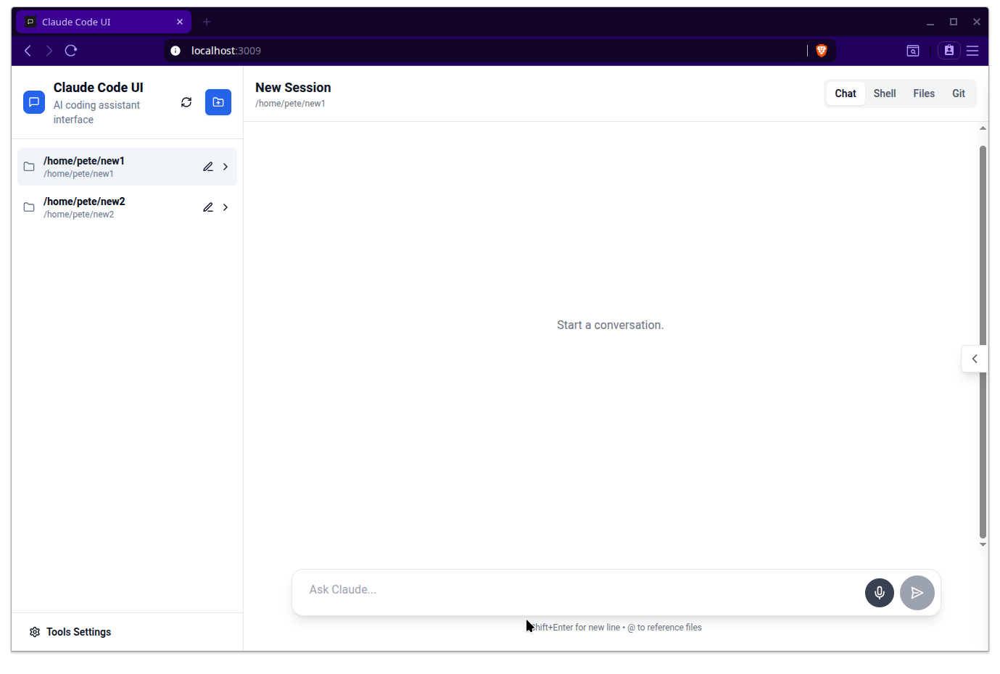
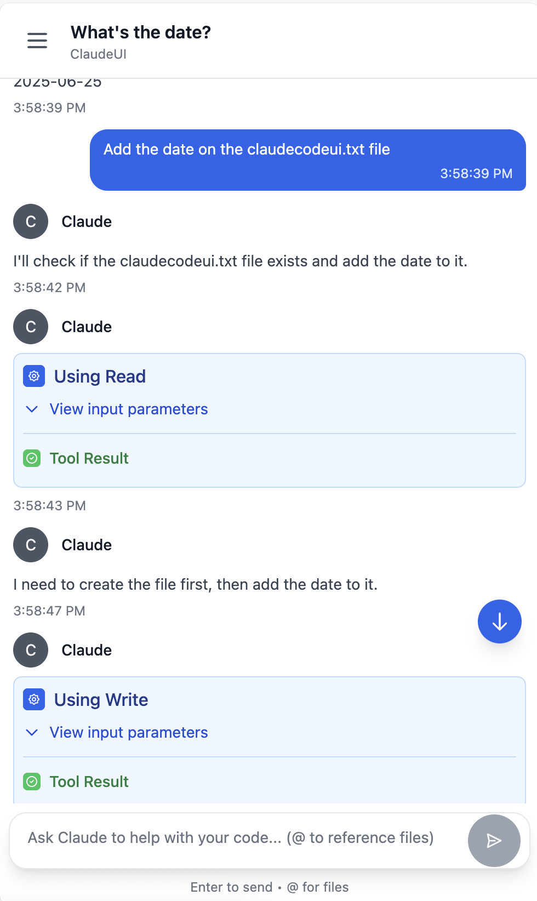
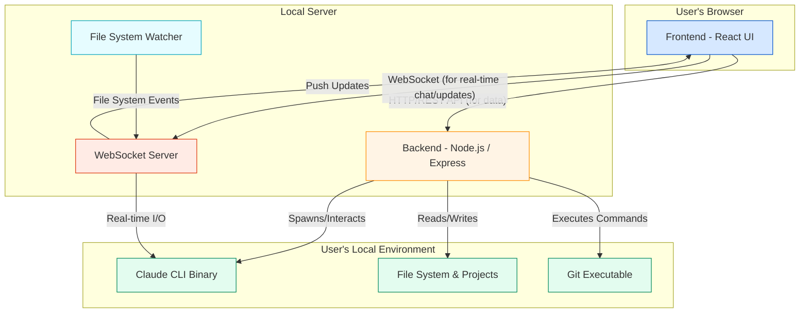

<div align="center">
  
  <h1 style="font-size: 2.5em; margin-bottom: 0.2em;">Claude Code Web UI</h1>
  <p style="font-size: 1.2em; color: hsl(215, 20.2%, 65.1%);">A rich, cross-device web interface for the <code>claude-code</code> CLI</p>
</div>

---

The **Claude Code Web UI** is a sophisticated, full-stack web application designed to serve as an interactive and secure user interface for Anthropic's `claude-code` Command Line Interface (CLI). It elevates the developer experience from a text-only terminal to a modern, graphical web interface that works on both desktop and mobile devices.

The application acts as a secure bridge to your local development environment, providing a comprehensive suite of tools that mirror and enhance the CLI's capabilities, including project management, real-time chat with AI, an integrated terminal, a file system explorer with live editing, and source control management via Git.

## Screenshots

<div align="center">
  
<table>
<tr>
<td align="center" style="padding: 10px; border: none;">
<h3>Desktop View</h3>

<br>
<em>Main interface showing project overview and chat</em>
</td>
<td align="center" style="padding: 10px; border: none;">
<h3>Mobile Experience</h3>

<br>
<em>Responsive mobile design with touch navigation</em>
</td>
</tr>
</table>
</div>

## Core Features

This application is packed with features designed for a seamless AI-assisted development workflow.

#### **Modern UI & UX**
*   **Responsive Design:** Fully functional and optimized for desktop, tablet, and mobile browsers.
*   **Theming:** Includes both light and dark modes that sync with system preferences.
*   **PWA Enabled:** Can be "installed" on desktop and mobile devices for a native-like experience.

#### **Enhanced Chat Interface**
*   **Real-time Streaming:** AI responses are streamed in real-time via a WebSocket connection.
*   **Rich Content Rendering:** Full support for Markdown, code blocks with syntax highlighting, and tables.
*   **Tool Visualization:** Tool usage by the AI is clearly visualized with expandable sections showing parameters and results, including rich diff views for file edits.
*   **Voice Input:** Integrated dictation using the Whisper API to transcribe speech to text, with optional AI-powered prompt enhancement.

#### **Integrated Development Tools**
*   **File Explorer:** An interactive file tree for browsing project structures.
*   **Live Code Editor:** A built-in CodeMirror editor for viewing and modifying files with syntax highlighting for multiple languages.
*   **Integrated Shell:** A full pseudo-terminal powered by `xterm.js`, providing direct access to the `claude-code` CLI and other shell commands within the project's directory.
*   **Source Control Panel:** A dedicated Git panel to view status, diffs, commit history, and perform commits directly from the UI.

#### **Project & Session Management**
*   **Automatic Project Discovery:** Automatically discovers projects from the `~/.claude/projects` directory.
*   **Robust Session Management:** All conversations are persisted locally. Users can easily resume previous sessions or start new ones within a project.
*   **Real-time Updates:** The project sidebar automatically refreshes when changes are made to the project directory on the file system, with a **Session Protection System** that prevents active chats from being interrupted.

#### **Security & Stability**
*   **Hardened Backend:** All backend endpoints are secured against path traversal attacks.
*   **Command Injection-Proof:** All Git and shell commands are executed using the secure `spawn` method, preventing command injection vulnerabilities.
*   **Memory Management:** The integrated shell uses an LRU (Least Recently Used) cache to manage terminal instances, preventing memory leaks and ensuring long-term stability.

## Architecture Overview

The system is architected with a clear separation of concerns between the frontend presentation layer and the backend service layer, which acts as a secure bridge to the local development environment.

### System Interaction Flowchart

This diagram illustrates the flow of information between the user's browser, the local backend server, and the user's local file system and tools.



### File Structure & Module Descriptions

The codebase is organized into distinct directories for the backend (`server/`), frontend (`src/`), and static assets (`public/`).

```
claude-code-ui/
├── server/             # Backend Node.js/Express application
│   ├── index.js        # Main server entry point, Express setup, WebSocket hub
│   ├── claude-cli.js   # Logic for spawning and managing the claude CLI process
│   ├── projects.js     # Data access layer for project and session files
│   ├── utils.js        # Security and utility functions (path validation, spawn wrapper)
│   └── routes/
│       └── git.js      # Express router for all /api/git endpoints
├── src/                # Frontend React application source
│   ├── components/     # Reusable React components
│   │   ├── ui/         # Base UI components (Button, Input, etc.)
│   │   ├── AppContext.jsx # Centralized React Context for state management
│   │   ├── ChatInterface.jsx   # Core chat component
│   │   └── ... (other components)
│   ├── contexts/       # React Context providers for state management
│   ├── utils/          # Frontend utility functions and hooks
│   ├── App.jsx         # Root React component, manages layout and routing
│   └── main.jsx        # Frontend entry point, renders the App
├── public/             # Static assets (icons, HTML template)
└── ...                 # Configuration files (package.json, vite.config.js, etc.)
```

#### Key Backend Modules (`server/`)

*   **`index.js`**: The main server entry point. It initializes the Express server, sets up API routes and middleware, creates the WebSocket server, and starts the file system watcher. It acts as the central hub for all backend operations.
*   **`utils.js`**: A critical security and utility module. It contains `isPathSafe` to prevent path traversal, `spawnAsync` as a secure replacement for `exec` to prevent command injection, and `getActualProjectPath` for reliably resolving project paths.
*   **`routes/git.js`**: An Express router that handles all Git-related API endpoints. It exclusively uses the `spawnAsync` utility to execute Git commands safely.
*   **`projects.js`**: The data access layer for all project and session information stored on the local file system in `~/.claude/projects`. It handles reading project structures, parsing session logs (`.jsonl` files), and managing project metadata.
*   **`claude-cli.js`**: The direct interface to the `claude` binary. It handles spawning the CLI process with the correct arguments (including tool permissions) and streams the JSON output back to the frontend via WebSockets.

#### Key Frontend Modules (`src/`)

*   **`main.jsx` & `contexts/AppContext.jsx`**: The heart of the frontend architecture. `AppContext` is a centralized React Context that manages all global application state (projects, selected project/session, UI settings, WebSocket messages, etc.). This eliminates "prop drilling" and makes the application significantly more maintainable. `main.jsx` wraps the entire application in this context provider.
*   **`App.jsx`**: The top-level component that orchestrates the overall layout and routing. It consumes the `AppContext` to get state and passes down only event handlers to its direct children (`Sidebar`, `MainContent`).
*   **`components/Sidebar.jsx`**: Renders the list of projects and their sessions. It is now fully decoupled, getting all its data from the `AppContext` and only receiving event handlers as props.
*   **`components/MainContent.jsx`**: A layout component that uses the `activeTab` state from `AppContext` to render the correct panel (`ChatInterface`, `FileTree`, `Shell`, or `GitPanel`). This component was a key part of the regression fix, as it no longer passes down state via props.
*   **`components/ChatInterface.jsx`**: The core chat UI. It is a self-sufficient component that consumes all necessary data (messages, selected project, etc.) and functions (`sendMessage`) from the `AppContext`.
*   **`components/Shell.jsx`**: Integrates the `xterm.js` library for the interactive terminal. It uses an `LRUCache` to manage terminal sessions, preventing memory leaks.
*   **`components/GitPanel.jsx` & `components/FileTree.jsx`**: Feature panels that are fully context-aware, fetching their own data and handling their own state.

## Getting Started: Installation and Usage

Follow these steps to get the Claude Code Web UI running on your local machine.

### Prerequisites

*   **[Node.js](https://nodejs.org/)**: Version 16 or higher is required.
*   **[Claude Code CLI](https://docs.anthropic.com/en/docs/claude-code)**: You must have the official CLI installed and configured on your system.
*   **(Optional) OpenAI API Key**: If you want to use the voice-to-text dictation feature, you need an OpenAI API key.

### Installation

1.  **Clone the Repository**
    ```bash
    git clone https://github.com/nordeim/Claude-Code-Web-UI.git
    cd Claude-Code-Web-UI
    ```

2.  **Install Dependencies**
    ```bash
    npm install
    ```

3.  **Configure Environment**
    Create a `.env` file by copying the example file. This file configures the ports for the backend and frontend servers.
    ```bash
    cp .env.example .env
    ```
    If you wish to use the dictation feature, add your OpenAI API key to the `.env` file:
    ```env
    # .env
    OPENAI_API_KEY="your-openai-api-key-here"
    ```

4.  **Run the Application**
    This command starts both the backend server and the frontend development server concurrently.
    ```bash
    npm run dev
    ```

5.  **Access the UI**
    Open your web browser and navigate to the address shown in your terminal, which is typically **`http://localhost:3009`**.

### Usage Guide

1.  **Project Creation:** The first time you run the application, the project list will be empty. Click the "Create new project" button (folder-plus icon) in the sidebar. Enter the absolute path to a project directory on your local machine (e.g., `/Users/yourname/dev/my-project`) or a relative path from your home directory (e.g., `dev/my-project`).
2.  **Starting a Session:** Once a project is created, it will appear in the sidebar. Click the "New Session" button under the project to start a conversation.
3.  **Interacting with Claude:**
    *   **Chat:** Type your prompts in the input box at the bottom. You can reference files by typing `@` to bring up a file search dropdown.
    *   **Shell:** Navigate to the "Shell" tab to get a direct, interactive terminal running `claude` in your project's directory.
    *   **Files:** Use the "Files" tab to browse your project's file tree and open files in the built-in editor.
    *   **Git:** Use the "Git" tab to manage your source control.

## Security & Tools Configuration

**🔒 Important Notice**: All Claude Code tools are **disabled by default** in this UI for security. This prevents potentially harmful operations (like running shell commands or writing files) from being executed by the AI without your explicit consent.

### Enabling Tools

To unlock the full power of Claude, you must manually enable the tools you are comfortable with.

1.  **Open Tools Settings:** Click the gear icon (`Tools Settings`) at the bottom of the sidebar.
2.  **Enable Tools:** You can enable specific tools using patterns (e.g., `Bash(git *)` to allow all `git` commands) or enable broad categories (e.g., `Write` to allow file writing).
3.  **Use with Caution:** For maximum convenience at the cost of security, you can enable the "Skip permission prompts" toggle. This is equivalent to running the CLI with the `--dangerously-skip-permissions` flag and is **not recommended** unless you fully trust the operations being performed.

<div align="center">


*The Tools Settings interface allows for granular control over AI permissions.*

</div>

## Roadmap & Future Improvements

This project has a solid foundation, but there are many opportunities for enhancement.

#### **Immediate Goals (Next Steps)**

1.  **Comprehensive Testing:**
    *   Implement a robust testing suite with Vitest.
    *   Add unit tests for critical backend utilities (`server/utils.js`) and frontend contexts (`AppContext.jsx`).
    *   Create integration tests for the API endpoints, especially for security-related checks.
    *   Develop end-to-end tests with a framework like Playwright or Cypress to prevent UI regressions.
2.  **UI/UX Polish:**
    *   Implement more sophisticated loading states (e.g., skeletons) for a smoother perceived performance.
    *   Enhance the Git panel with more interactive features like staging individual lines (hunks).
    *   Improve keyboard navigation and accessibility throughout the application.
3.  **Complete Live Preview Feature:**
    *   The backend contains preliminary code for starting a development server. This feature should be fully implemented to allow users to start a dev server (like `npm run dev`) and see a live preview of their web application within the UI.

#### **Long-Term Vision**

1.  **Multi-Workspace & Multi-Window Support:** Allow users to open multiple projects simultaneously in different tabs or windows, similar to a modern IDE.
2.  **Remote Development:** Extend the architecture to allow the UI to connect to a backend server running on a remote machine, enabling development on cloud instances or other computers.
3.  **Plugin Architecture:** Develop a plugin system that would allow for third-party extensions, such as custom tools, themes, or data visualizers.
4.  **Optional Session Syncing:** While currently a local-first application, a future version could offer an optional cloud-based backend (e.g., using a database like PostgreSQL or Supabase) to allow users to sync their session history across multiple devices.
5.  **Enhanced PWA Functionality:** Improve the service worker to provide more robust offline capabilities, allowing users to review session history even without a connection to the backend server.

## Contributing

We welcome contributions! Please see the `CONTRIBUTING.md` file for guidelines on how to contribute to this project.

## License

This project is licensed under the MIT License. See the `LICENSE` file for details.
