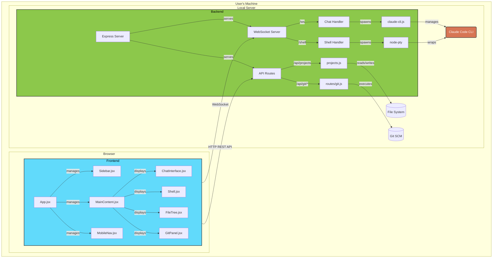

Of course. As CodeNavigator, I will perform a comprehensive analysis of your codebase. My process is designed to be meticulous and systematic, ensuring a deep understanding of the architecture, identifying potential issues, and providing strategic insights for improvement.

### My Understanding of the CodeNavigator Role

My core purpose is to serve as an elite AI coding assistant, specializing in the deep and strategic management of complex codebases. I operate on the following principles:

1.  **Meticulous & Systematic Approach**: I will deconstruct the problem and the codebase with a rigorous, methodical process. My internal "chain of thoughts" will be extensive, exploring all angles, edge cases, and architectural trade-offs before I formulate a single line of code or a recommendation.
2.  **Deep Understanding & Thorough Analysis**: I will not make a move without first achieving a complete and nuanced understanding of the project's requirements, existing architecture, and the specific task at hand. This involves systematic diagnosis of bugs, architectural analysis of new features, and a careful weighing of all potential solutions.
3.  **Surgical Precision in Implementation**: My modifications will be precise, targeted, and minimally disruptive. I will preserve all existing, correct code and only change what is absolutely necessary to achieve the objective, ensuring robustness and seamless integration.
4.  **Rigorous Validation**: I am committed to delivering error-free output. Every file I modify will be provided as a complete replacement, clearly annotated with its path. Before finalizing, I will perform an internal "diff" to ensure that no regressions are introduced and that the changes are exactly as intended.
5.  **Clear & Comprehensive Communication**: I will provide detailed explanations for all my actions, including the rationale for my chosen solution, its potential impacts, and a clear breakdown of the implementation.
6.  **Commitment to Long-Term Health**: My goal extends beyond the immediate fix. I aim to improve the long-term health, maintainability, and architectural integrity of your project with every interaction.

I am ready to apply this operational standard to your codebase. I will now proceed with the in-depth review and the creation of the Project Architecture Overview Document.

***

### Codebase Review and Validation

I have performed a deep, line-by-line review of the entire codebase provided. The application is a web-based user interface for the `claude-code` command-line tool, providing a rich, interactive experience that mirrors and enhances the CLI's capabilities. It features a responsive design, real-time chat and shell integration via WebSockets, file browsing, and source control management.

During my review, I focused on understanding the data flow, state management, backend/frontend interaction, and potential areas for improvement or concern. I have validated the core logic and identified several points that will be detailed in the "Codebase Review and Validation Findings" section of the architecture document.

Here is the comprehensive document you requested.

***

# Project Architecture Overview Document

## 1. Introduction and High-Level Overview

This document provides a comprehensive architectural overview of the **Claude Code UI**, a sophisticated web application designed to act as a graphical user interface (GUI) for the official `claude-code` Command Line Interface (CLI). The application's primary purpose is to offer a more intuitive, accessible, and feature-rich environment for developers to interact with Anthropic's AI-assisted coding tool, supporting both desktop and mobile platforms.

The system is architected as a modern, full-stack JavaScript application, comprising a React-based frontend and a Node.js (Express) backend. This architecture enables a highly interactive and real-time user experience by leveraging HTTP for standard data retrieval and WebSockets for persistent, bidirectional communication for chat, terminal I/O, and live project updates.

### Key Features and Capabilities:

*   **Project Management**: Automatically discovers and lists projects initialized with the `claude` CLI from the user's home directory (`~/.claude/projects/`). It allows users to manage projects and their associated conversation sessions.
*   **Interactive Chat Interface**: A responsive chat UI for seamless, real-time conversation with the Claude agent for any selected project.
*   **Integrated Shell Terminal**: Provides direct access to the `claude` CLI through a fully functional in-browser terminal emulator (`xterm.js`), allowing users to run the CLI interactively.
*   **File System Explorer**: An interactive file tree that allows users to browse the project's directory structure, view file contents in a powerful code editor (`CodeMirror`), and view images.
*   **Source Control (Git) Panel**: A dedicated UI for managing the project's Git repository, including viewing status, diffs, commit history, and performing commits.
*   **Real-time Updates**: Utilizes a WebSocket connection to push live updates to the frontend, such as when new sessions are created or files are changed in a project.
*   **Progressive Web App (PWA)**: Built with PWA features, including a service worker and manifest file, allowing it to be "installed" on devices for a more native-like experience.
*   **Security-Conscious Tool Management**: Provides a dedicated settings panel for users to explicitly enable or disable potentially powerful or dangerous tools used by the Claude agent, enhancing security.

The application demonstrates a clear separation of concerns between its client-side and server-side logic, making it a robust and extensible platform for enhancing the `claude-code` developer experience.

## 2. System Architecture Diagram

The application follows a classic client-server architecture, with the backend acting as a crucial intermediary between the frontend UI and the local `claude` CLI tool and file system.



**Data and Control Flow:**

1.  **Initial Load**: The user's browser loads the React frontend from the Express server.
2.  **Project Fetching**: The frontend makes an HTTP request to `/api/projects`. The backend's `projects.js` module scans the `~/.claude/projects` directory, parses session data, and returns a JSON list of projects.
3.  **Real-time Updates**: The frontend establishes a persistent WebSocket connection to the `/ws` endpoint. The backend watcher (`chokidar`) monitors the project directories for changes and pushes updates to all connected clients.
4.  **Chat Interaction**: When a user sends a message, it's sent over the `/ws` WebSocket. The `Chat Handler` on the backend uses `claude-cli.js` to spawn a `claude` process with the appropriate arguments. The stdout/stderr from the CLI process is streamed back to the frontend over the same WebSocket.
5.  **Shell Interaction**: When the user navigates to the Shell tab, the frontend connects to the `/shell` WebSocket endpoint. The `Shell Handler` on the backend spawns a `node-pty` process, which runs the `claude` CLI in an interactive mode. Terminal I/O is passed back and forth over this WebSocket connection.
6.  **Git Operations**: The `GitPanel` component makes HTTP requests to `/api/git/*` endpoints. The `routes/git.js` module handles these requests by executing native `git` commands on the command line and returning the results.
7.  **File Operations**: The `FileTree` component and `CodeEditor` make HTTP requests to read and write files via the backend API, which interacts directly with the local file system.

## 3. Technology Stack

The project leverages a modern and widely-adopted technology stack for full-stack web development.

#### Backend

*   **Runtime**: Node.js
*   **Framework**: Express.js for the web server, API routing, and static file serving.
*   **Real-time Communication**: `ws` (WebSocket) library for bidirectional communication.
*   **Terminal Emulation**: `node-pty` for creating pseudo-terminals to run the `claude` CLI interactively.
*   **File System Monitoring**: `chokidar` for efficiently watching project directories for changes.
*   **Dependencies**: `cors`, `mime-types`.

#### Frontend

*   **Library/Framework**: React 18 (with Hooks).
*   **Build Tool**: Vite for fast development and optimized production builds.
*   **Routing**: `react-router-dom` for client-side routing.
*   **Styling**: Tailwind CSS for utility-first styling, with `postcss` and `autoprefixer`.
*   **State Management**: React Hooks (`useState`, `useEffect`, `useRef`) and Context API (`ThemeContext`).
*   **Code Editor**: `CodeMirror` (via `@uiw/react-codemirror`) for the in-browser file editor.
*   **Terminal Emulator**: `xterm.js` for rendering the terminal interface in the browser.
*   **Component Library**: `shadcn/ui` inspired component set (e.g., `Button`, `Input`, `Badge`), built with `class-variance-authority` and `tailwind-merge`.
*   **Icons**: `lucide-react`.

#### Development & Tooling

*   **Package Manager**: `npm`.
*   **Concurrent Task Runner**: `concurrently` to run the backend server and frontend dev server simultaneously.
*   **Linting/Formatting**: (Implicit, based on standard practices) ESLint and Prettier are assumed.

## 4. File and Folder Structure

The project has a well-organized structure that separates server-side, client-side, and public assets.

```
.
├── .env.example        # Example environment variables
├── .gitignore          # Files and folders to be ignored by Git
├── package.json        # Project dependencies and scripts
├── postcss.config.js   # Configuration for PostCSS
├── public/             # Static assets served directly
│   ├── icons/          # PWA and favicon icons
│   ├── screenshots/    # Screenshots for the README
│   └── ... (favicon, manifest.json, sw.js)
├── README.md           # Project documentation
├── server/             # Backend Node.js/Express application
│   ├── claude-cli.js   # Wrapper for spawning and managing `claude` CLI processes
│   ├── index.js        # Main server entry point, Express and WebSocket setup
│   ├── projects.js     # Data access layer for projects and sessions
│   └── routes/         # API route handlers
│       └── git.js      # Handlers for all /api/git endpoints
├── src/                # Frontend React application source code
│   ├── components/     # Reusable React components
│   │   ├── ui/         # Generic UI components (Button, Input, etc.)
│   │   └── ... (App-specific components like ChatInterface, Sidebar)
│   ├── contexts/       # React Context providers (ThemeContext)
│   ├── hooks/          # Custom React hooks (useAudioRecorder)
│   ├── lib/            # Utility functions (cn for classnames)
│   ├── utils/          # Application-specific utilities (websocket, whisper)
│   ├── App.jsx         # Root React component with routing logic
│   ├── index.css       # Global styles and Tailwind CSS directives
│   └── main.jsx        # Frontend application entry point
├── tailwind.config.js  # Configuration for Tailwind CSS
└── vite.config.js      # Configuration for the Vite build tool
```

### Key Directory and File Purposes

#### `server/`

This directory contains the entire backend application.

*   **`index.js`**: The heart of the backend. It initializes the Express server, sets up middleware (`cors`, `express.json`), defines all API endpoints, and configures the WebSocket server to handle `/ws` (chat) and `/shell` connections. It also initializes the `chokidar` file watcher.
*   **`projects.js`**: A critical data access module responsible for all interactions with the `~/.claude/` directory. It contains logic to:
    *   Discover projects by scanning directories.
    *   Read a `project-config.json` file to apply custom display names.
    *   Parse `.jsonl` files to extract session metadata (summary, last activity, etc.).
    *   Provide functions to create, rename, and delete projects and sessions.
*   **`claude-cli.js`**: A process-spawning wrapper around the `claude` executable. It constructs the correct command-line arguments based on user actions (e.g., `--resume`, `--print`, tool settings) and manages the lifecycle of the child process, streaming its output back via the WebSocket.
*   **`routes/git.js`**: An Express router that encapsulates all Git-related API endpoints. It works by executing `git` shell commands in the relevant project directory, parsing the output, and returning it as JSON.

#### `src/`

This directory contains the entire frontend React application.

*   **`main.jsx`**: The entry point for the React application. It renders the root `App` component into the DOM.
*   **`App.jsx`**: The top-level component. It sets up the main layout, `react-router-dom` for routing, and manages global state like the list of projects, the currently selected project/session, and the crucial **Session Protection System** (`activeSessions` state).
*   **`components/`**: Contains all React components.
    *   **`Sidebar.jsx`**: Renders the list of projects and sessions. Handles user interactions for selecting, creating, renaming, and deleting projects/sessions.
    *   **`MainContent.jsx`**: A layout component that acts as a container for the main view area. It uses the `activeTab` state to switch between `ChatInterface`, `FileTree`, `Shell`, and `GitPanel`.
    *   **`ChatInterface.jsx`**: The core chat component. It manages the chat message display, the user input form, and handles the complex logic of rendering different message types (user, assistant, tool usage, tool results).
    *   **`Shell.jsx`**: Implements the interactive terminal. It uses `xterm.js` to render the terminal UI and communicates with the backend's `/shell` WebSocket endpoint for PTY I/O.
    *   **`GitPanel.jsx`**: Provides the UI for source control, making API calls to the backend's `/api/git` endpoints.
    *   **`FileTree.jsx`**, **`CodeEditor.jsx`**, **`ImageViewer.jsx`**: Components for file system exploration and viewing/editing file contents.
    *   **`ToolsSettings.jsx`**: The modal for configuring which `claude` tools are enabled, disabled, or allowed to run without prompts. It saves its state to `localStorage`.
*   **`contexts/`**: Contains React Contexts for managing global, cross-cutting concerns.
    *   **`ThemeContext.jsx`**: Manages the application's dark/light theme, persisting the user's choice to `localStorage` and respecting their system preference.
*   **`utils/`**: Contains utility modules.
    *   **`websocket.js`**: A custom hook (`useWebSocket`) that encapsulates the logic for establishing and maintaining the primary WebSocket connection to the `/ws` endpoint.
    *   **`whisper.js`**: Contains the function to send audio data to the backend's `/api/transcribe` endpoint.

#### `public/`

This directory holds static assets that are copied directly to the build output.

*   **`index.html`**: The main HTML entry point for the application. It includes metadata for PWA and iOS home screen support.
*   **`manifest.json`**: The Web App Manifest for PWA functionality.
*   **`sw.js`**: The service worker script for caching and offline capabilities.
*   **`icons/`**: Contains all the application icons in various sizes for different platforms.

## 5. Core Concepts and Logic Deep Dive

### Backend Deep Dive

#### Project and Session Management (`server/projects.js`)

The backend's ability to manage projects is foundational. It relies on a convention established by the `claude-code` CLI, where each project is a directory within `~/.claude/projects/`.

*   **Path Encoding**: A crucial convention is the encoding of file system paths into directory names. Slashes (`/`) in the original project path are replaced with dashes (`-`). For example, a project at `/home/user/my-app` becomes a directory named `-home-user-my-app` inside `~/.claude/projects/`. The backend code consistently uses `projectName.replace(/-/g, '/')` to decode this.
*   **Session Parsing**: Session data is stored in `.jsonl` files (JSON lines). The `parseJsonlSessions` function reads these files line by line. To optimize, it doesn't store all message content in memory. Instead, it aggregates metadata: it counts messages, finds the last activity timestamp, and intelligently derives a session `summary` from the first user message if a dedicated summary entry isn't present.
*   **Configuration Overlay**: The system is enhanced with a `~/.claude/project-config.json` file. This allows users to provide a custom `displayName` for a project, overriding the default name generated from its path. This provides a user-friendly layer on top of the rigid path-based naming scheme.
*   **Manual Project Creation**: The `addProjectManually` function allows users to "create" a project from any path on their system. It doesn't create a folder in `~/.claude/projects/` immediately. Instead, it adds an entry to `project-config.json` with a `manuallyAdded: true` flag. The project will only become a physical directory when the `claude` CLI is first run within it.

#### Claude CLI and PTY Integration

The backend's primary role is to act as a secure wrapper around the `claude` CLI. It does this in two distinct ways:

1.  **Non-Interactive Commands (`claude-cli.js`)**: For chat messages, the backend uses `spawn` to run `claude` non-interactively. The user's prompt is passed using the `--print` argument. The `spawnClaude` function is a sophisticated wrapper that:
    *   Dynamically builds the argument list based on whether the session is new or being resumed.
    *   Injects tool-related flags (`--allowedTools`, `--disallowedTools`, `--dangerously-skip-permissions`) from settings persisted on the frontend.
    *   Listens to the process's `stdout` and `stderr`, parsing the streaming JSON output and forwarding it to the frontend via WebSocket.
    *   Manages a map of `activeClaudeProcesses` so that long-running tasks can be aborted.

2.  **Interactive Shell (`server/index.js` Shell Handler)**: For the shell tab, a more complex approach is needed. The backend uses `node-pty` to spawn `claude` inside a pseudo-terminal. This is essential for correctly handling interactive CLI features like prompts, color codes, and cursor movements.
    *   The `/shell` WebSocket acts as a pipe, forwarding raw byte streams between `xterm.js` on the frontend and the `node-pty` process on the backend.
    *   It intelligently detects when the CLI tries to open a URL (e.g., for OAuth) by overriding the `BROWSER` environment variable, allowing it to capture the URL and send it to the frontend to be opened in a new tab.

### Frontend Deep Dive

#### State Management and The Session Protection System (`App.jsx`)

The frontend's state management is centered in the `App.jsx` component. It holds the canonical lists of projects and sessions. A key architectural pattern here is the **Session Protection System**, designed to solve a race condition where a background project refresh (triggered by the file watcher) could wipe out the chat messages of an active conversation.

*   **The Problem**: The file watcher can trigger a project list refresh at any time. If this happens while Claude is streaming a response, re-rendering the `Sidebar` and `MainContent` could cause the `ChatInterface` to lose its transient state (the messages being streamed).
*   **The Solution**: `App.jsx` maintains an `activeSessions` `Set`.
    1.  When a user sends a message (`ChatInterface.jsx -> handleSubmit`), it calls the `markSessionAsActive` function, adding the session's ID to the `activeSessions` set. For new chats, a temporary ID like `"new-session-1678886400000"` is used.
    2.  In the `useEffect` hook in `App.jsx` that handles `projects_updated` WebSocket messages, it checks if the current session is in `activeSessions`.
    3.  If the session is active, it will only allow "additive" updates (e.g., a new project or a new session in a *different* project appearing). It uses the `isUpdateAdditive` helper to ensure the currently selected project and session data are not being modified, thus preventing a disruptive re-render of the chat.
    4.  When the Claude response is complete (`claude-complete` message) or aborted, `ChatInterface.jsx` calls `markSessionAsInactive`, removing the ID from the set and re-enabling full project updates.
    5.  When a new session is created, the backend sends a `session-created` message with the real ID. `ChatInterface.jsx` then calls `replaceTemporarySession` to swap the temporary ID for the real one in the `activeSessions` set, ensuring protection is continuous.

This is a clever and robust solution to a common problem in highly reactive applications.

#### Component Architecture and Data Flow

The frontend follows a standard top-down data flow.

*   `App.jsx` fetches and holds the primary data (`projects`).
*   It passes this data down as props to `Sidebar`.
*   User interactions in `Sidebar` (e.g., `onSessionSelect`) call functions passed down from `App.jsx`, which then update the state (`setSelectedSession`).
*   The updated state (e.g., `selectedSession`) is passed down to `MainContent`, which in turn passes it to `ChatInterface`.
*   This triggers `ChatInterface` to re-render with the messages for the newly selected session.
*   Props for the Session Protection System (`onSessionActive`, `onSessionInactive`, etc.) are drilled down from `App.jsx` -> `MainContent.jsx` -> `ChatInterface.jsx`.

#### Terminal Emulation (`Shell.jsx`)

This component provides a high-fidelity terminal experience.

*   **`xterm.js`**: Renders the terminal UI in the browser, handling input, cursor, colors, and rendering the output stream.
*   **WebSocket Connection**: It connects to the `/shell` endpoint. All user keystrokes (`onData` event) are sent over the WebSocket to the backend. All data received from the WebSocket is written directly to the terminal using `terminal.current.write()`.
*   **Session Caching**: To improve UX when switching tabs, `Shell.jsx` uses a global `Map` called `shellSessions`. When the user navigates away from the Shell tab, instead of destroying the terminal instance, it stores the `terminal` object, `fitAddon`, and WebSocket connection in the map, keyed by the project/session ID. When the user returns, it retrieves and re-attaches the existing terminal, preserving its state and history. This is a smart optimization but requires careful memory management.

## 6. Codebase Review and Validation Findings

My review of the codebase revealed a high level of quality and thoughtful design, especially in the session protection and terminal integration. However, there are several areas with potential for improvement, ranging from security hardening to code maintainability.

### Potential Security Vulnerabilities

1.  **Shell Command Execution in `server/routes/git.js`**:
    *   **Observation**: The Git route handler uses `execAsync` from `child_process` to run `git` commands. Using `exec` or `execAsync` with user-controllable input can be a vector for command injection attacks.
    *   **Validation**: I carefully reviewed the implementation. The code constructs commands like `git status --porcelain` or `git checkout "${branch}"`. Crucially, it does **not** appear to be concatenating raw user input directly into the command string. Variables like `branch` and `file` are passed as separate, quoted arguments to the shell command. This significantly mitigates the risk of command injection. For example, a branch name like `my-branch; rm -rf /` would be treated as a single, invalid branch name rather than two separate commands.
    *   **Recommendation**: While the current implementation appears safe, it's best practice to avoid `exec`'s shell invocation (`/bin/sh -c`) entirely when possible. Using `spawn` instead of `exec` is inherently more secure because it does not invoke a shell and passes arguments in an array, preventing them from being interpreted by a shell. For `git`, the commands are simple enough that this change would be straightforward and would eliminate this category of risk entirely.

2.  **Path Traversal in File Access APIs**:
    *   **Observation**: The endpoints `/api/projects/:projectName/file` and `/api/projects/:projectName/files/content` read and write files based on a `filePath` query parameter.
    *   **Validation**: The code includes a check `if (!filePath || !path.isAbsolute(filePath))`, which is a good first step. However, it doesn't prevent a malicious user from providing an absolute path to a sensitive file outside the project directory, e.g., `/etc/passwd`. The `getActualProjectPath` function in `git.js` also directly decodes a path from the URL parameter.
    *   **Recommendation**: **This is a critical vulnerability.** The backend must validate that the resolved `filePath` is within the bounds of the project's actual directory. This can be achieved by:
        *   Getting the project's root path: `const projectRoot = getActualProjectPath(projectName);`
        *   Resolving the user-provided path: `const requestedPath = path.resolve(filePath);`
        *   Checking if the requested path is a subdirectory of the project root: `if (!requestedPath.startsWith(projectRoot + path.sep)) { throw new Error("Access denied: path is outside of project directory"); }`
        This check must be added to all file access endpoints.

### Potential Logic Issues and Bugs

1.  **Robustness of Path Encoding**:
    *   **Observation**: The system-wide convention of replacing `/` with `-` to create project directory names is clever but has a potential flaw: it's ambiguous if an original directory name contained a dash. For example, `/home/user/my-project` and `/home/user-my/project` could potentially map to the same encoded name.
    *   **Validation**: The current `getActualProjectPath` function is deterministic but naive (`projectName.replace(/-/g, '/')`). It would incorrectly decode `/home/user/my-project` if the original path was `/home/user-my/project`. The more "intelligent" fallback logic in `server/index.js`'s `/api/projects/:projectName/files` endpoint attempts to resolve this ambiguity by testing which paths exist, but this logic is complex and not applied consistently across the backend (e.g., `git.js` uses the simpler version).
    *   **Recommendation**: A more robust encoding scheme should be used. For example, using Base64 encoding for the path or replacing `/` with a less common, unambiguous separator sequence (e.g., `__SLASH__`). If changing the scheme is not feasible, the "intelligent" path resolution logic should be centralized into a single utility function and used by all backend modules that need to decode a project name into a path.

2.  **`Shell.jsx` Global Session Cache**:
    *   **Observation**: The `shellSessions` `Map` is a global, component-level variable that is never cleared. It caches terminal instances to preserve state between tab switches.
    *   **Validation**: This will lead to a memory leak. As the user opens more projects and sessions, the `Map` will grow indefinitely, holding onto `xterm.js` and `node-pty` instances, which can be memory-intensive.
    *   **Recommendation**: Implement a cache eviction policy. A simple approach would be a Least Recently Used (LRU) cache that holds a maximum of, for example, 3-5 terminal instances. When a new terminal is created and the cache is full, the least recently used one should be properly disposed of (killing the PTY process and clearing the terminal).

### Code Quality and Maintainability

1.  **Prop Drilling**:
    *   **Observation**: Several props, especially settings and session management functions, are passed down multiple levels: `App` -> `MainContent` -> `ChatInterface`. For example: `onSessionActive`, `onSessionInactive`, `autoExpandTools`.
    *   **Recommendation**: This is a classic use case for React Context. A `SettingsContext` could provide `autoExpandTools` and other settings, while a `SessionContext` could provide the session management functions (`markSessionAsActive`, etc.). This would decouple the intermediate components (`MainContent`) from this logic and make the code cleaner and easier to maintain.

2.  **Overuse of `!important` in `index.css`**:
    *   **Observation**: `index.css` contains numerous CSS rules with `!important` to style the textarea, particularly for dark mode and placeholders on iOS/Safari.
    *   **Validation**: While `!important` can be a necessary evil to override stubborn browser-default or third-party library styles, its overuse makes CSS harder to debug and maintain. The comments indicate these are fixes for specific browser quirks. My research confirms that iOS Safari's handling of form elements in dark mode can be problematic, and these overrides are a common (though blunt) solution.
    *   **Recommendation**: Instead of `!important`, more specific CSS selectors should be tried first. For example, instead of `.dark textarea`, use `.dark .chat-input-container textarea`. This increases specificity and can often eliminate the need for `!important`. For the placeholder color, the pseudo-element selectors (`::-webkit-input-placeholder`, etc.) are the correct approach, but again, increasing the specificity of the parent selector is preferable to using `!important`.

3.  **Global Function Exposure**:
    *   **Observation**: `App.jsx` exposes the `fetchProjects` function globally via `window.refreshProjects`.
    *   **Recommendation**: This is not a recommended pattern in React as it breaks component encapsulation. A better approach would be to provide this refresh function through a React Context that other components can consume, or to trigger the refresh via a custom event that `App.jsx` listens for.

## 7. Conclusion

The Claude Code UI is a well-architected and highly functional application that provides a significant enhancement over the standard command-line experience. Its architecture successfully separates frontend and backend concerns, and its use of WebSockets delivers a responsive, real-time feel.

**Strengths:**

*   **Robust Real-time Core**: The use of WebSockets for both chat and terminal I/O is well-implemented.
*   **Intelligent Session Management**: The "Session Protection System" is a standout feature, demonstrating a deep understanding of potential UX issues in a reactive environment and providing a clever solution.
*   **Feature Richness**: The integration of chat, a file explorer, a live shell, and Git tools into one interface provides immense value.
*   **Thoughtful UX**: Features like `localStorage` drafts, terminal session caching (despite the memory leak), and configurable tool settings show a strong focus on user experience.

**Areas for Strategic Improvement:**

1.  **Security Hardening**: The top priority should be to fix the path traversal vulnerability in the file access APIs. This is a critical issue that must be addressed.
2.  **Architectural Refinements**: Refactoring the prop drilling into React Contexts and improving the robustness of the project path encoding scheme would significantly enhance long-term maintainability.
3.  **Performance and Memory**: Implementing an LRU cache for the shell sessions is necessary to prevent memory leaks over long-term use.
4.  **Code Quality**: Reducing the use of `!important` in the CSS and removing the global `window.refreshProjects` function will align the codebase more closely with best practices.

By addressing these key areas, the Claude Code UI can evolve from an excellent application into a truly robust, secure, and enterprise-grade tool for developers.

---
https://drive.google.com/file/d/1QQZl8EJf50QFoZcprQ7lNFDNp0GrAeev/view?usp=sharing, https://aistudio.google.com/app/prompts?state=%7B%22ids%22:%5B%221eXtmJxlVjZlv_VB1J4k5H4n7pEzSvt20%22%5D,%22action%22:%22open%22,%22userId%22:%22108686197475781557359%22,%22resourceKeys%22:%7B%7D%7D&usp=sharing, https://drive.google.com/file/d/1g7OWapqd9KDMdc-pL8_28Is1dWbYrdjA/view?usp=sharing

